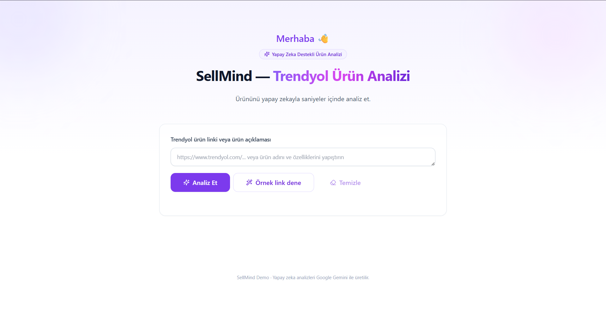
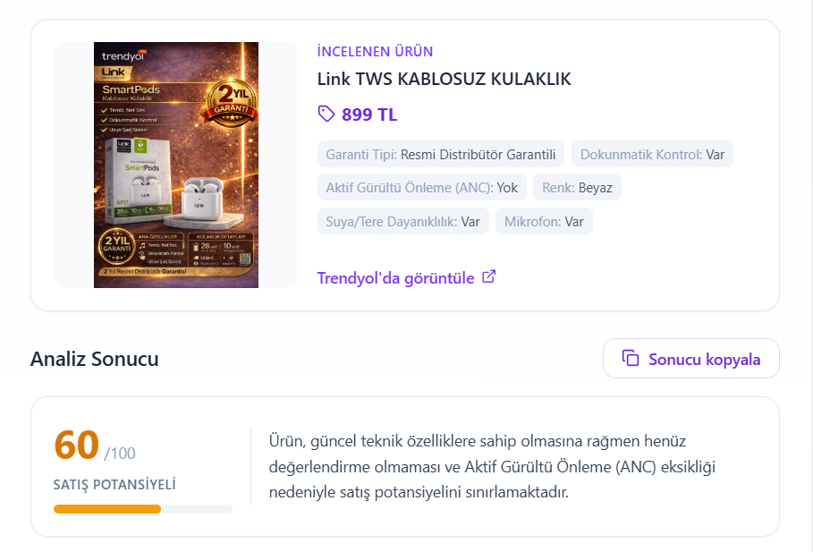
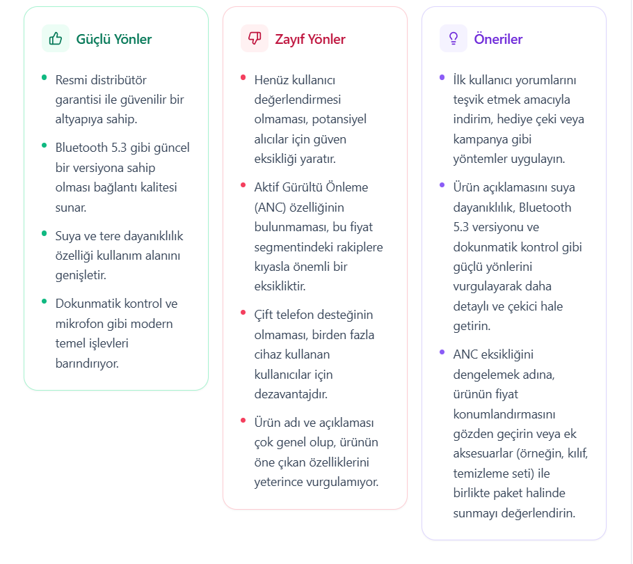

# SellMind — Trendyol Ürün Analizi (Demo)

> Üniversite burs başvurusu (ApplyBAU / İKÜ WeAccept) için hazırlanmış, **tek sayfalık, çalışan** bir yapay zeka demosudur.

### 🌐 **Canlı Demo → [sell-mind.vercel.app](https://sell-mind.vercel.app)**

Kullanıcı bir Trendyol ürün linki (veya ürün açıklaması) yapıştırır, **Analiz Et**'e basar ve
Google Gemini ile üretilen gerçek bir analiz alır: **güçlü yönler, zayıf yönler ve somut öneriler.**

---

## ✨ Ne Yapar?

- Trendyol ürün linkini/açıklamasını alır.
- Sunucu tarafında **Google Gemini** ile analiz eder.
- Sonucu üç renk kodlu kartla gösterir:
  - 🟢 **Güçlü Yönler**
  - 🔴 **Zayıf Yönler**
  - 🟣 **Öneriler** (en fazla 3)
- Anahtar yoksa veya bir hata olursa **çökmez**; nazik bir Türkçe mesaj gösterir.

## 🧩 Teknolojiler

| Katman | Seçim |
|---|---|
| İskelet | Next.js (App Router) + TypeScript |
| Stil | Tailwind CSS |
| Bileşenler | shadcn/ui tarzı (Button / Card / Badge) |
| Animasyon | Framer Motion |
| İkonlar | lucide-react |
| Yapay Zeka | Google Gemini (`@google/genai`, model: `gemini-2.5-flash`) |
| Test | Vitest + React Testing Library |

## 🚀 Nasıl Çalıştırılır?

1. **Bağımlılıkları kur:**
   ```bash
   npm install
   ```

2. **Gemini API anahtarını ekle:**
   - [Google AI Studio](https://aistudio.google.com) → *Get API key* (ücretsiz, kredi kartı gerekmez).
   - Proje kökünde `.env.local` dosyası oluştur ve içine yaz:
     ```
     GEMINI_API_KEY=buraya_anahtarınızı_yapıştırın
     ```
   - `.env.local` git tarafından yok sayılır; **anahtar asla repoya gitmez.**

3. **Geliştirme sunucusunu başlat:**
   ```bash
   npm run dev
   ```
   Tarayıcıda [http://localhost:3000](http://localhost:3000) adresini aç.

## 🧪 Testler

```bash
npm test
```

Üç odaklı test: JSON ayrıştırma yardımcı fonksiyonu, sonuç kartlarının render'ı ve
formun başarılı/hatalı durum davranışı.

## 🔒 Güvenlik

- Gemini çağrısı **yalnızca sunucu tarafında** (`app/api/analyze/route.ts`) yapılır.
- API anahtarı yalnızca `process.env.GEMINI_API_KEY` üzerinden okunur; istemciye asla sızdırılmaz.
- `.env.local` ve tüm `.env*` dosyaları `.gitignore` ile korunur.

## 🌐 Canlı Demo

Uygulama Vercel üzerinde yayında:

### 👉 **[https://sell-mind.vercel.app](https://sell-mind.vercel.app)**

> Not: Canlı sürümde Vercel **Environment Variables** kısmına `GEMINI_API_KEY` eklenmiştir.

## 📸 Ekran Görüntüleri







## 🎬 Demo Videosu

https://github.com/BurakBerksoy/SellMind/raw/main/images/demo.mp4

> Video oynatılmazsa **[buraya tıklayarak izleyebilirsiniz](images/demo.mp4)**.

---

*Bu bir demodur. Tam sürümde mağaza bağlanıp tüm ürünler otomatik analiz edilecektir.*
